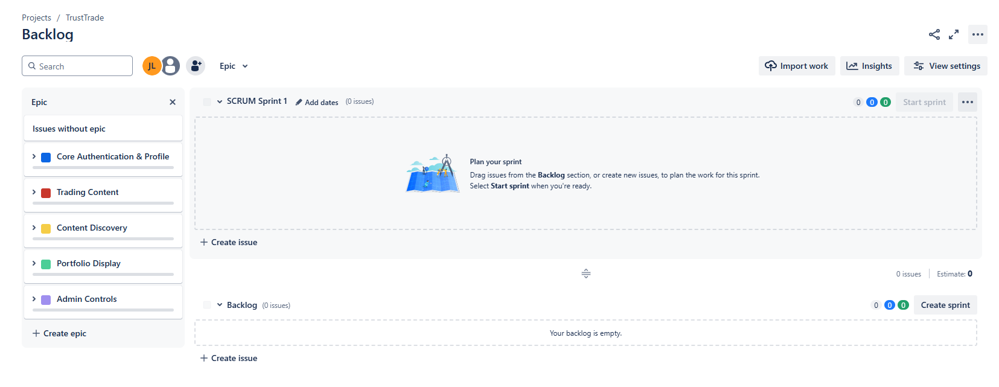

# Milestone 3

1. ## [Updated Vision Statement](project_artifacts/VisionStatement.md)
2. ## [Stakeholders](project_artifacts/Stakeholders.md) and [Personas](project_artifacts/Personas.md)
3. ## [Timeline and Release Plan](project_artifacts/Timeline.md)
4. ## [Needs and Features Revised](project_artifacts/NeedsAndFeatures.md)
5. ## [Requirements E & A](project_artifacts/Requirements.md)
6. ## [Initial System Architecture](project_artifacts/ArchitectureAndModels.md)
7. ## [Modeling Outputs](project_artifacts/ArchitectureAndModels.md)
8. ## Jira Set up and Epics Entered

### Backlog: [Jira Link](https://mail-team-whd8951o.atlassian.net/jira/software/projects/SCRUM/boards/1/backlog?epics=visible)

