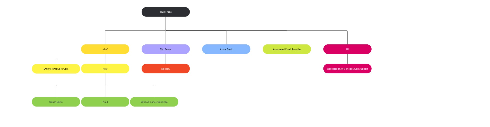
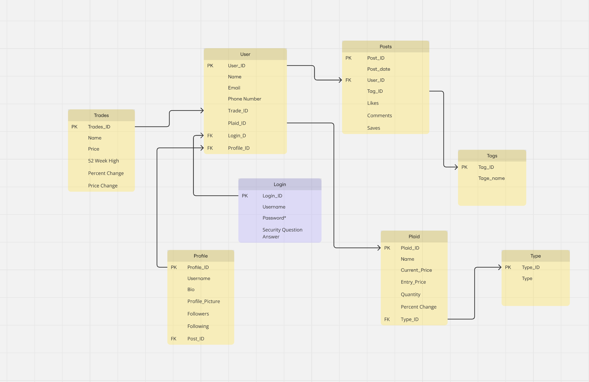
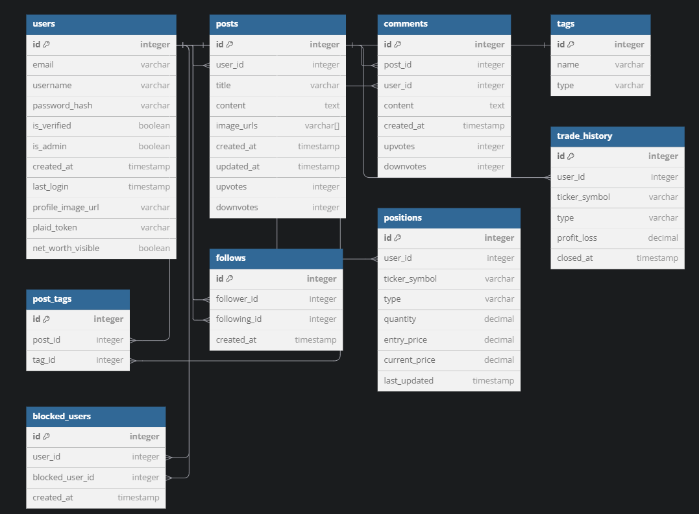
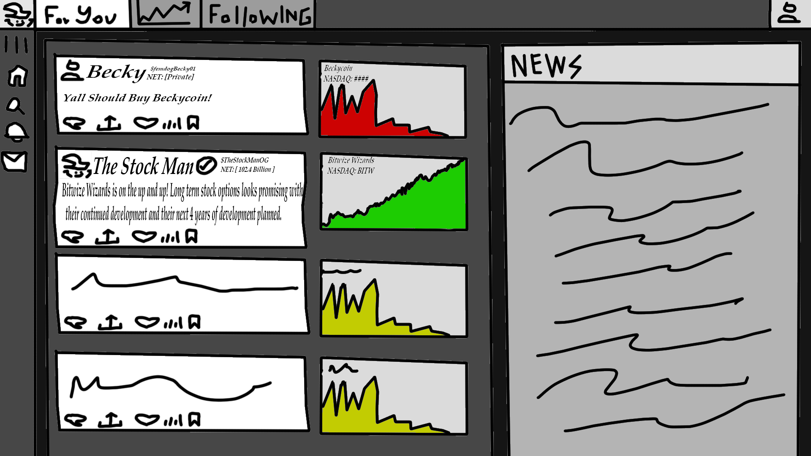

# Architecture and Models

## Project System and Network Architecture: [Miro Link](https://miro.com/welcomeonboard/RE44Tm12anZwMXNGd3l1RWZOclM0Z0ZPSm0wTEw5MXQ3TWp3OWFCQjFCcEJqc2x4VytkRXB2VXIvdEtHc3BwWi9nbVZLQXJSWjAza2FIZVl1dk1CVWxjSnJLQlhNTE15ZUVxM3ZQN2xENlcyMHVjMTIvcHNCOTNsdStCd01zenchZQ==?share_link_id=321696217431)

## Data Modeling: [Miro Link](https://miro.com/app/board/uXjVLoIVti0=/)

## UI Modeling
